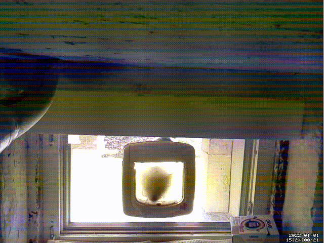

<div align="center">
  
  <br />
  <h1>Cat Intruder Bot</h1>
  <strong>🚨🐈 A Telegram bot, which warns about cat intruders.</strong>
  <br />
  <br />
  <br />
</div>

## About

This repository contains the source code for a Telegram bot, which warns users whenever a cat entered through the kitty door.

To be more precise, this bot consists of two parts:

1. A [shell script](telegram_handler.sh), which is called every time [motion](https://motion-project.github.io) has detected a movement. This script then sends a Telegram message together with the newly recorded video clip of the cat intruder.
2. A [Cloudflare Worker](https://www.cloudflare.com/workers/), which receives a notification about the cat detection after the user confirmed the sighting via an inline keyboard. It then proceeds to ask subsequent questions to gain more information about the incident (e.g. name of the intruder, direction of movement, etc...). Using this information, a new database entry is created and may be used for further projects.

## Prerequisites

- [motion](https://motion-project.github.io) running on a Raspberry Pi (or similar device), fitted with a camera.
- [Telegram](https://telegram.org), including a registered bot (see [Bots documentation](https://core.telegram.org/bots)).
- [Cloudflare Worker](https://www.cloudflare.com/workers/) account.
- [FaunaDB](https://fauna.com) account, or provide your own GraphQL server using the provided [schema.gql](schema.gql).

## Setup

### Raspberry Pi

1. Install and set up motion on your Raspberry Pi (register [shell script](telegram_handler.sh) as `on_movie_end` event handler in your `motion.conf` file).

   ```bash
   on_movie_end /home/pi/.motion/telegram_handler.sh %f  # %f is the filename of the video clip (provided by motion)
   ```

2. Be sure to set the `TELEGRAM_*` environment variables listed in [.env.sample](.env.sample) in your system, so that your message shows up in the correct Telegram chat using the correct Telegram Bot.
3. Wait for detections.

### Cloudflare Worker

1. Enter necessary credentials in `.env`, or provide them as system-wide environment variables.
2. `yarn` or `npm install`
3. `yarn build` or `npm run build`
4. `npx wrangler publish` or provide your own publish action.
5. Add a [Webhook](https://core.telegram.org/bots/webhooks) to your Telegram Bot, pointing to the URL of your Cloudflare Worker.

### Local development & debugging

1. Run `yarn serve` or `npm run serve` to start the local development server.
2. Tunnel your local server via [localtunnel](https://localtunnel.me/) or equivalent tunnel services.
3. Register the resulting tunnel URL as a [Webhook](https://core.telegram.org/bots/webhooks) to your Telegram Bot. Warning - this action overrides the currently registered Webhook URL!

## Disclaimer

I'm not affiliated to any of the mentioned services and/or applications mentioned above.

## License

Licensed under the MIT License.

Copyright ©️ 2022 [Sascha Zarhuber](https://sascha.work)
